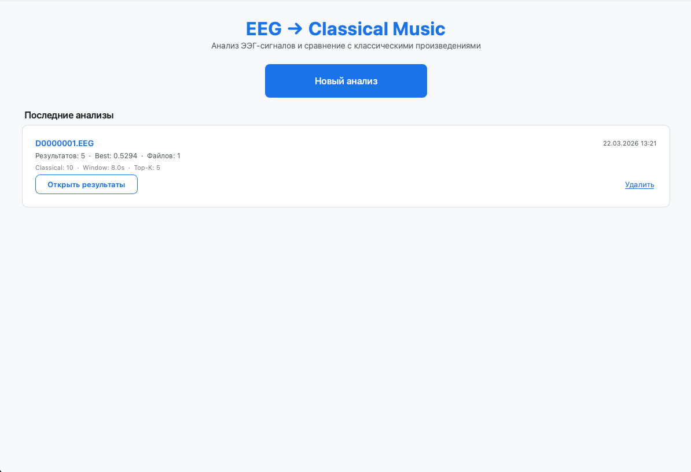
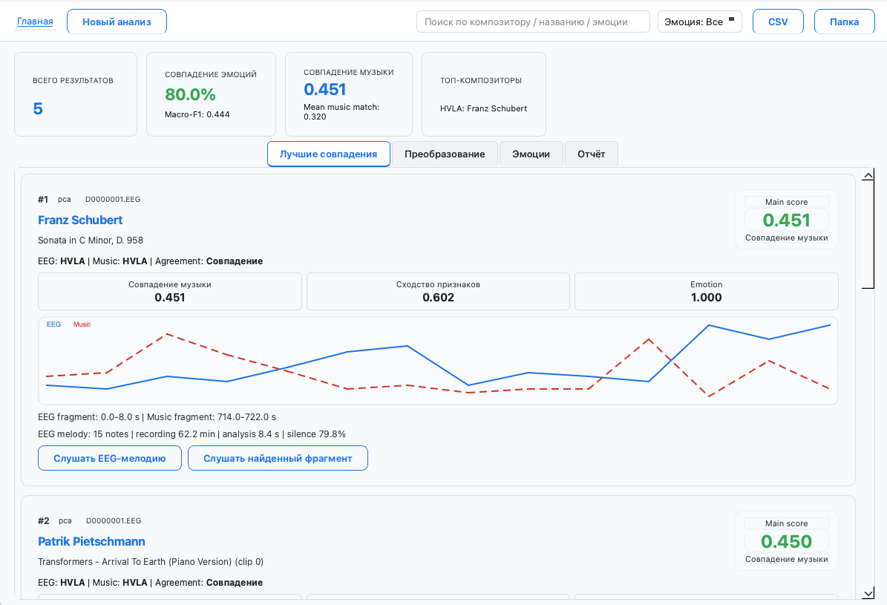
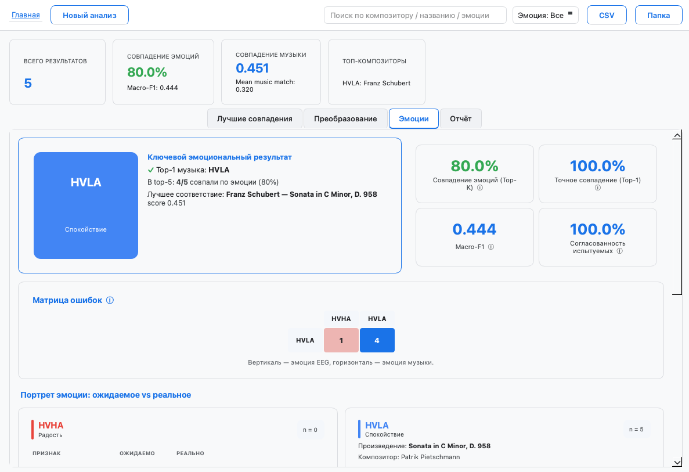
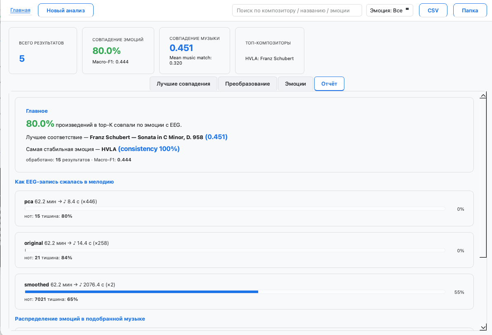

# EEG-to-Classical-Music

GUI-приложение и исследовательский pipeline для проверки гипотезы об эмоциональном соответствии между EEG человека и классическими музыкальными произведениями.

Основной сценарий такой:

`ЭЭГ -> определение эмоции -> генерация мелодии -> сопоставление с музыкой -> проверка эмоционального соответствия`

## Что делает проект

- загружает EEG из файлов Neurosoft `.eeg` или из DEAP `.dat`
- определяет эмоциональный класс EEG
- генерирует мелодическое представление из EEG
- сравнивает его с ограниченным набором классических произведений
- проверяет, совпадает ли эмоция EEG с эмоцией лучшего музыкального соответствия
- показывает результат в компактном GUI с графиками, таблицами и аудио

## Поддерживаемые входы

- Neurosoft `.eeg`
- DEAP `.dat`


## Структура проекта

```text
EEG-to-classical-music/
├── data/
│   ├── deap_dataset/
│   │   └── data_preprocessed_python/
│   ├── maestro-v3.0.0/
│   ├── EMOPIA_1.0/
│   └── FluidR3_GM.sf2
├── gui/
│   ├── app.py
│   ├── main_window.py
│   ├── worker.py
│   └── pages/
├── scripts/
│   ├── run_comparison.py
│   ├── window_size_experiment.py
│   ├── pseudo_label_maestro.py
│   └── label_maestro_emotions.py
├── src/
│   ├── config.py
│   ├── deap_loader.py
│   ├── neurosoft_loader.py
│   ├── eeg_preprocessing.py
│   ├── eeg_processing.py
│   ├── midi_utils.py
│   ├── MIDIComparator.py
│   ├── track_features.py
│   ├── evaluation.py
│   ├── emopia_loader.py
│   ├── maestro_loader.py
│   └── audio_converter.py
├── runs/
├── requirements.txt
└── eeg_app.spec
```

## Датасеты и файлы

Все внешние данные должны лежать в папке `data/`.

### 1. DEAP

- источник: [DEAP dataset](https://www.eecs.qmul.ac.uk/mmv/datasets/deap/) или [этот источник](https://www.kaggle.com/datasets/manh123df/deap-dataset)
- положить сюда: `data/deap_dataset/data_preprocessed_python/`
- ожидаемые файлы: `s01.dat`, `s02.dat`, ...

### 2. MAESTRO

- источник: [MAESTRO dataset](https://magenta.tensorflow.org/datasets/maestro)
- положить сюда: `data/maestro-v3.0.0/`
- проект использует MIDI и метаданные MAESTRO
- если в `maestro-v3.0.0.csv` еще нет эмоций, их можно подготовить offline-скриптами:
  - `scripts/label_maestro_emotions.py`
  - `scripts/pseudo_label_maestro.py`

### 3. EMOPIA

- источник: [EMOPIA project page](https://annahung31.github.io/EMOPIA/)
- положить сюда: `data/EMOPIA_1.0/`
- внутри должны быть `label.csv`, MIDI-файлы и metadata JSON

### 4. SoundFont (`.sf2`)

- проект ожидает файл: `data/FluidR3_GM.sf2`
- можно использовать [FluidR3_GM.sf2](https://musical-artifacts.com/artifacts/738) или любой совместимый General MIDI SoundFont, переименовав его в `FluidR3_GM.sf2`
- если system soundfont уже установлен, встроенный playback может работать и без ручной подмены

## Установка

Требования:

- Python 3.9+
- FluidSynth в системе

### macOS

```bash
brew install fluid-synth
python3 -m venv .venv
source .venv/bin/activate
pip install -r requirements.txt
```

### Linux

```bash
sudo apt install fluidsynth
python3 -m venv .venv
source .venv/bin/activate
pip install -r requirements.txt
```

## Запуск GUI

```bash
python -m gui.app
```

В приложении можно:

- загрузить один или несколько `.eeg`
- выбрать DEAP `.dat`
- выбрать режим `single` или `group`
- запустить анализ
- посмотреть `Best Matches`, `Emotion Analysis`, `Summary / Insights`

## Запуск через CLI

Основной CLI-скрипт:

```bash
python scripts/run_comparison.py
```

Пример для DEAP:

```bash
python scripts/run_comparison.py \
  --participants 3 \
  --trials 5 \
  --classical 40 \
  --top 5 \
  --window-size 8 \
  --hop-size 4
```

## Сравнение размеров окна

Для экспериментального обоснования выбора окна есть отдельный скрипт:

```bash
python scripts/window_size_experiment.py \
  --window-sizes 4 8 12 \
  --participants 5 \
  --classical 40 \
  --top 5 \
  --balanced-eeg-emotions \
  --per-emotion-trials 4
```

Скрипт сохранит в `runs/<experiment_name>/`:

- `window_size_summary.csv`
- `window_size_summary.json`
- `window_size_summary.md`
- `window_size_summary.png`


## Что сохраняется после запуска

Артефакты каждого запуска лежат в `runs/run_XXX/`.

Типичный результат:

```text
runs/run_018/
├── eeg_midi/
└── report/
    ├── comparison_results.csv
    ├── display_results.json
    ├── confusion_matrix.csv
    ├── confusion_matrix.png
    ├── emotion_distribution.png
    ├── cohort_emotion_summary.csv
    ├── top_matches_summary.csv
    ├── melody_diagnostics.csv
    ├── best_eeg_melody_timeline.png
    └── matches/
```

## Ключевые метрики

- `Music Match` — основной score музыкального соответствия
- `Feature Similarity` — сходство по компактному набору музыкальных признаков
- `Emotion Match Rate` — доля top-1 совпадений по эмоции
- `Macro-F1` — качество различения эмоциональных классов
- `Group Consistency` — согласованность результатов по группе EEG одной эмоции

## GUI

### 1. Best Matches

- лучшие произведения по `Music Match`
- композитор и название
- эмоция EEG и эмоция произведения
- matched fragments
- прослушивание EEG-мелодии и найденного музыкального фрагмента

### 2. Emotion Analysis

- ключевой эмоциональный результат
- confusion matrix
- распределение эмоций
- таблица по эмоциям и top musical matches

### 3. Summary / Insights

- итоговый вывод по лучшему совпадению
- top composers by emotion
- signal coverage для EEG-мелодии
- most selected works


## Screenshots







## Пример демонстрации приложения


1. Загрузка EEG-файла или DEAP `.dat`
2. Запуск пайплайна
3. Определение EEG-эмоции
4. Генерация мелодии
5. Поиск лучшего музыкального соответствия
6. Проверка эмоционального совпадения

## Сборка десктопного приложения

Spec-файл для PyInstaller:

```bash
pyinstaller eeg_app.spec
```

## Источники

1. Destexhe, A., Foubert, B. Listening to the brain: sonification of EEG, LFP and spiking activity.
2. Wu et al. Методы музыкально-признакового анализа и similarity.
3. Miranda, E. R. Brain-computer music interface.
